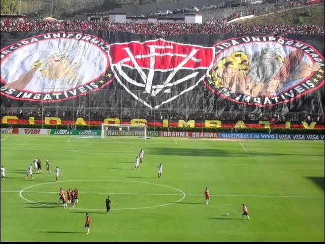

## 🌠     

<a href="https://samuelrocha91.github.io" target="_blank">访问我的个人网站</a>

 <h2>项目技术列表</h2> 

<h2> 🎭️ React 项目 </h2> 

- 🎮 [问答游戏](https://github.com/SamuelRocha91/trivia_game/blob/main/README_ch.md)
- 🐣 [宝可梦图鉴](https://github.com/SamuelRocha91/pokedex/blob/main/README_ch.md)
- 🏪 [前端在线商店](https://github.com/SamuelRocha91/project-frontend-online-store/blob/main/README_ch.md)
- 👛 [开销管理器](https://github.com/SamuelRocha91/project-trybewallet/blob/main/README_ch.md)

<h2> 🪢️ Node 项目 </h2> 

- 🗡️ [Trybe Smith](https://github.com/SamuelRocha91/TrybeSmith/blob/main/README_ch.md)
- 🪧 [博客 API](https://github.com/SamuelRocha91/BlogsApi/blob/main/README_ch.md)
- 🐉 [Trybers 和 Dragons](https://github.com/SamuelRocha91/trybeAndDragons/blob/main/README_ch.md)
- ⚽ [TypeScript 足球 API](https://github.com/SamuelRocha91/trybeFutebolClube/blob/main/README_ch.md)

<h2> 👶️ 初学者项目 </h2> 

- 🖥️ [二进制转换器](https://github.com/SamuelRocha91/Bin2Dec/blob/main/README_ch.md)
- 🎨 [像素艺术](https://github.com/SamuelRocha91/PixelsArt/blob/main/README_ch.md)
- 📝 [待办事项列表](https://github.com/SamuelRocha91/TodoList/blob/main/README_ch.md)
- 🧮 [计算器](https://github.com/SamuelRocha91/calculator/blob/main/README_ch.md)
- 🦖 [表情包生成器](https://github.com/SamuelRocha91/memeGenerator/blob/main/README_ch.md)
- 🪐 [星球大战行星](https://github.com/SamuelRocha91/javascriptStarWarsPlanets/blob/main/README_ch.md)

<h2> 🔋️ 全栈项目 </h2> 

### 送货
  - 💎 [送货后端](https://github.com/SamuelRocha91/delivery_back/blob/main/README_ch.md) - Rails 送货平台后端应用
  - 🛒 [Consumy 应用](https://github.com/SamuelRocha91/consumy/blob/main/README_ch.md) - 消费者应用
  - 👨‍💼 [卖家应用](https://github.com/SamuelRocha91/seller_application/blob/main/README_ch.md) - 卖家应用
  - 💲 [支付 API](https://github.com/SamuelRocha91/paymenty/blob/main/README_ch.md) - 支付 API

### 测量 API
  - 📏 [React 精准应用](https://github.com/SamuelRocha91/precisionReactApplication/blob/main/README_ch.md) - 用于记录气体和水的测量的界面
  - 🤖 [Node API](https://github.com/SamuelRocha91/apiMeasureWaterAndGas/blob/main/README_ch.md) - 用于记录测量和消费的 API

<h2> ☕️ Java 项目 </h2> 

- 🌾 [Agrix 项目 - 农场管理](https://github.com/SamuelRocha91/Agrix/blob/main/README_ch.md)
- 🏛️ [博物馆定位器](https://github.com/SamuelRocha91/localizadorDeMuseus/blob/main/README_ch.md)
- 📃 [进展规则](https://github.com/SamuelRocha91/project_rule_of_progression/blob/main/README_ch.md)
- 🗳️ [投票系统](https://github.com/SamuelRocha91/sistemaDeVotacao/blob/main/README_ch.md)

<h2> 📱️ Kotlin 项目 </h2> 

- 📜 [虚拟菜单](https://github.com/SamuelRocha91/kotlinVirtualMenu/blob/main/README_ch.md)
- ☀️ [天气预报应用](https://github.com/SamuelRocha91/kotlinWeatherApp/blob/main/README_ch.md)
- 💱 [Kotlin 汇率](https://github.com/SamuelRocha91/kotlinExchangeRate/blob/main/README_ch.md)
- 👤 [社交登录](https://github.com/SamuelRocha91/kotlinLoginSocial/blob/main/README_ch.md)

<h2> 🔴 Ruby 项目 </h2> 

- 📽️ [Rails 电影目录](https://github.com/SamuelRocha91/rails_movies_catalog/blob/main/README_ch.md)
- 👩‍⚖️ [Odin 练习](https://github.com/SamuelRocha91/ruby_exercises/blob/main/README_ch.md)

<h2> 🎲️ 数据库项目 </h2> 

- 🚗 [汽车租赁](https://github.com/SamuelRocha91/dbRentalCar/blob/main/README_ch.md)

<h2> 🐍️ Python 项目 </h2> 

- 7⃣️ [算法](https://github.com/SamuelRocha91/Algorithms/blob/main/README_ch.md)
- 🍲 [餐厅订单](https://github.com/SamuelRocha91/restaurantOrders/blob/main/README_ch.md)
- ✍️ [脚本](https://github.com/SamuelRocha91/scripts/blob/main/README_ch.md)
- 🕵️‍♀️ [Trybe 不是 Google](https://github.com/SamuelRocha91/trybeIsNotGoogle/blob/main/README_ch.md)

<h2>🧑 关于我：</h2>

萨缪尔·罗查，巴西人🇧🇷，来自萨尔瓦多⚫🔴，网页开发者。

<h2>灵魂之窗</h2>

    
    
    
    

